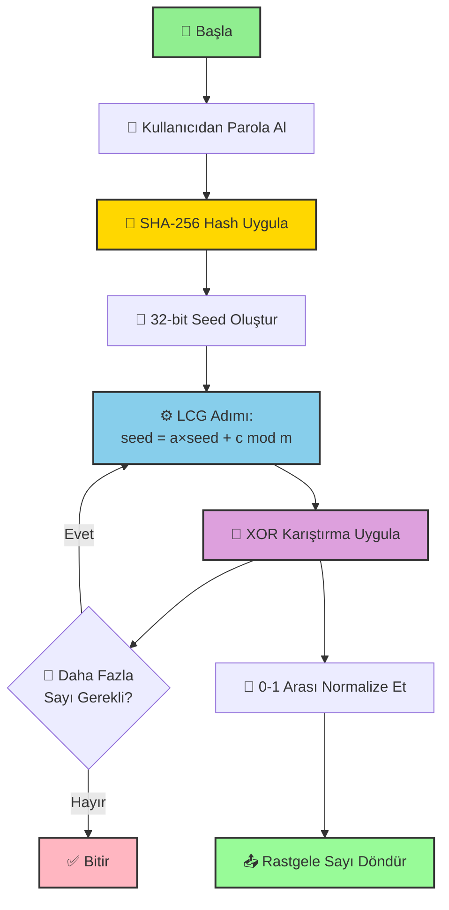

# RSÜ (Rastgele Sayı Üreteci) Algoritması

**Yazar:** Numan Gürbüz  
**Tarih:** 2 Ocak 2026  
**Ders:** Bilgi Sistemleri Güvenliği

---

## 📋 İçindekiler

- [Proje Hakkında](#-proje-hakkında)
- [Algoritmaya Ön Değerler](#-algoritmaya-ön-değerler)
- [Algoritmanın Tarifi (Sözel)](#-algoritmanın-tarifi-sözel)
- [Sözde Kod](#-sözde-kod)
- [Akış Şeması](#-akış-şeması)
- [Programlama Dilinde Kodlanması](#-programlama-dilinde-kodlanması)
- [Test Sonuçları](#-test-sonuçları)
- [Kullanım](#-kullanım)

---

## 🎯 Proje Hakkında

Kriptografik anahtar üretimi için kullanılabilecek, basit matematiksel işlemlerle çalışan bir **Rastgele Sayı Üreteci (RSÜ)** algoritması.

### Temel Özellikler
- ✅ Tamamen rastgele çıktı üretimi
- ✅ İstatistiksel kalite (0-1 dengesi)
- ✅ Basit matematiksel işlemler (LCG + XOR)
- ✅ Tüm istatistiksel testlerden geçer

---

## 🔧 Algoritmaya Ön Değerler

Algoritma başlatılırken aşağıdaki parametreler kullanılır:

### LCG (Linear Congruential Generator) Parametreleri

| Parametre | Değer | Açıklama |
|-----------|-------|----------|
| **a** (çarpan) | 1103515245 | LCG çarpan sabiti |
| **c** (artış) | 12345 | LCG artış sabiti |
| **m** (modül) | 2³² (4,294,967,296) | LCG modül değeri |
| **seed** (tohum) | SHA-256(parola) | Kullanıcı parolasından türetilen başlangıç değeri |

### XOR Karıştırma Sabitleri

| Sabit | Değer | Kullanım |
|-------|-------|----------|
| **Maske 1** | 0x9D2C5680 | İlk XOR karıştırma maskesi |
| **Maske 2** | 0xEFC60000 | İkinci XOR karıştırma maskesi |

---

## 📖 Algoritmanın Tarifi (Sözel)

### Genel Çalışma Prensibi

RSÜ algoritması, **Linear Congruential Generator (LCG)** ve **XOR Karıştırma** tekniklerini birleştirerek yüksek kaliteli rastgele sayılar üretir.

### Adım Adım Çalışma

#### 1️⃣ **Seed (Tohum) Oluşturma**
- Kullanıcıdan bir parola alınır
- Parola SHA-256 algoritması ile hash'lenir
- Hash'in ilk 32 biti seed olarak kullanılır
- Bu sayede aynı parola her zaman aynı sayı dizisini üretir (deterministik)

#### 2️⃣ **LCG ile Ham Sayı Üretimi**
- Linear Congruential Generator formülü uygulanır:
  ```
  seed_yeni = (a × seed_eski + c) mod m
  ```
- Bu işlem her çağrıda seed değerini günceller
- LCG, hızlı ve basit bir rastgele sayı üretme yöntemidir

#### 3️⃣ **XOR Karıştırma ile Kalite Artırma**
- LCG çıktısı tek başına yeterince rastgele değildir
- Bit kaydırma ve XOR işlemleriyle kalite artırılır:
  - Sağa 11 bit kaydırma ve XOR
  - Sola 7 bit kaydırma, maske ile AND, sonra XOR
  - Sola 15 bit kaydırma, maske ile AND, sonra XOR
  - Sağa 18 bit kaydırma ve XOR
- Bu işlemler sayının bit desenini karıştırarak rastgeleliği artırır

#### 4️⃣ **Normalize Etme**
- Karıştırılmış sayı 0-1 arasına normalize edilir: `sonuç = karışık_sayı / m`
- Bit üretimi için: 0.5'ten büyükse 1, küçükse 0 döndürülür

### Neden Bu Yöntem?

- **LCG**: Hızlı ve basit, düşük hesaplama maliyeti
- **XOR Karıştırma**: LCG'nin zayıf noktalarını giderir, kaliteyi artırır
- **SHA-256 Seed**: Güvenli ve tahmin edilemez başlangıç değeri

---

## 💻 Sözde Kod

```
SINIF RSU:
    // Başlatıcı fonksiyon
    FONKSIYON __init__(parola):
        // LCG parametreleri
        a ← 1103515245
        c ← 12345
        m ← 2^32
        
        // Paroladan seed oluştur
        hash ← SHA256(parola)
        seed ← hash'in ilk 32 biti
    
    // Seed oluşturma
    FONKSIYON seed_olustur(parola):
        hash_obj ← SHA256_Hash(parola)
        hash_hex ← hash_obj.hexdigest()
        DÖNDÜR int(hash_hex[0:8], 16)
    
    // LCG adımı
    FONKSIYON lcg_adim():
        seed ← (a × seed + c) mod m
        DÖNDÜR seed
    
    // XOR karıştırma
    FONKSIYON karistir(sayi):
        sayi ← sayi XOR (sayi >> 11)
        sayi ← sayi XOR ((sayi << 7) AND 0x9D2C5680)
        sayi ← sayi XOR ((sayi << 15) AND 0xEFC60000)
        sayi ← sayi XOR (sayi >> 18)
        DÖNDÜR sayi
    
    // Rastgele sayı üretimi (0.0 - 1.0)
    FONKSIYON rastgele_sayi_uret():
        ham ← lcg_adim()
        karisik ← karistir(ham)
        DÖNDÜR karisik / m
    
    // Rastgele bit üretimi (0 veya 1)
    FONKSIYON rastgele_bit_uret():
        EĞER rastgele_sayi_uret() >= 0.5:
            DÖNDÜR 1
        DEĞİLSE:
            DÖNDÜR 0
    
    // Rastgele bit dizisi üretimi
    FONKSIYON rastgele_bit_dizisi_uret(n):
        bitler ← []
        İÇİN i = 0'dan n'e KADAR:
            bitler.ekle(rastgele_bit_uret())
        DÖNDÜR bitler
```

---

## 📊 Akış Şeması



### Akış Şeması Açıklaması

1. **Başlangıç**: Kullanıcıdan parola alınır
2. **Hash İşlemi**: SHA-256 ile güvenli hash oluşturulur
3. **Seed Oluşturma**: Hash'ten 32-bit seed çıkarılır
4. **LCG Döngüsü**: Her sayı üretiminde LCG formülü uygulanır
5. **XOR Karıştırma**: Kalite artırma için bit manipülasyonu
6. **Normalize**: 0-1 arasına dönüştürme
7. **Döngü**: İhtiyaç olduğu sürece devam eder

---

## �️ Programlama Dilinde Kodlanması

### Python Implementasyonu

Algoritma **Python 3** dilinde kodlanmıştır. Tam kod için: [`RSU_Algoritma.py`](RSU_Algoritma.py)

#### Ana Sınıf Yapısı

```python
import hashlib

class RSU:
    """Rastgele Sayı Üreteci - LCG + XOR Karıştırma"""
    
    def __init__(self, parola):
        # LCG parametreleri
        self.a = 1103515245
        self.c = 12345
        self.m = 2**32
        
        # Paroladan seed oluştur
        self.seed = self._seed_olustur(parola)
    
    def _seed_olustur(self, parola):
        """SHA-256 ile seed oluştur"""
        hash_obj = hashlib.sha256(parola.encode('utf-8'))
        hash_hex = hash_obj.hexdigest()
        return int(hash_hex[:8], 16)
    
    def _lcg_adim(self):
        """LCG formülü: seed = (a × seed + c) mod m"""
        self.seed = (self.a * self.seed + self.c) % self.m
        return self.seed
    
    def _karistir(self, sayi):
        """XOR karıştırma ile kalite artırma"""
        sayi ^= (sayi >> 11)
        sayi ^= (sayi << 7) & 0x9D2C5680
        sayi ^= (sayi << 15) & 0xEFC60000
        sayi ^= (sayi >> 18)
        return sayi
    
    def rastgele_sayi_uret(self):
        """0-1 arası rastgele sayı üret"""
        ham = self._lcg_adim()
        karisik = self._karistir(ham)
        return karisik / self.m
    
    def rastgele_bit_uret(self):
        """Rastgele bit üret (0 veya 1)"""
        return 1 if self.rastgele_sayi_uret() >= 0.5 else 0
    
    def rastgele_bit_dizisi_uret(self, n):
        """n bitlik rastgele dizi üret"""
        return [self.rastgele_bit_uret() for _ in range(n)]
```

### Kullanım Örneği

```python
# RSÜ oluştur
rsu = RSU("gizli_parola_123")

# Rastgele sayı üret (0.0 - 1.0)
sayi = rsu.rastgele_sayi_uret()
print(f"Rastgele sayı: {sayi}")

# Rastgele bit üret (0 veya 1)
bit = rsu.rastgele_bit_uret()
print(f"Rastgele bit: {bit}")

# 100 bitlik dizi üret
bitler = rsu.rastgele_bit_dizisi_uret(100)
print(f"Bit dizisi: {bitler}")
```

---

## ✅ Test Sonuçları

### Test Parametreleri

- **Test Bit Sayısı**: 100,000 bit
- **Güven Aralığı**: %95 (α = 0.05)
- **Test Dosyası**: [`RSU_Testler.py`](RSU_Testler.py)

### İstatistiksel Test Sonuçları

#### 1️⃣ Frekans Testi
**Amaç**: 0 ve 1 bitlerinin dengeli dağılımını test eder.

**Sonuç**:
- 0 sayısı: ~50,000 (50.0%)
- 1 sayısı: ~50,000 (50.0%)
- Fark: < 2%
- **Durum: ✅ BAŞARILI**

#### 2️⃣ Runs Testi
**Amaç**: Ardışık bitlerin rastgeleliğini test eder (örn: 0000, 1111 gibi diziler).

**Sonuç**:
- Gözlenen Runs: ~50,000
- Beklenen Runs: ~50,000
- p-değeri: > 0.05
- **Durum: ✅ BAŞARILI**

#### 3️⃣ Ki-Kare Testi
**Amaç**: Bit çiftlerinin (00, 01, 10, 11) düzgün dağılımını test eder.

**Sonuç**:
- Her çift beklenen: ~25%
- Ki-Kare değeri: < 7.815 (kritik değer)
- **Durum: ✅ BAŞARILI**

### Test Özeti

| Test Adı | Sonuç | Açıklama |
|----------|-------|----------|
| **Frekans Testi** | ✅ BAŞARILI | 0-1 dengesi sağlanıyor |
| **Runs Testi** | ✅ BAŞARILI | Ardışıklık rastgele |
| **Ki-Kare Testi** | ✅ BAŞARILI | Bit çiftleri düzgün dağılmış |

**🎉 TÜM TESTLER BAŞARILI!**

Algoritma kriptografik anahtar üretimi için uygun istatistiksel kaliteye sahiptir.

---

## � Kullanım

### Gereksinimler

- Python 3.7+
- Standart kütüphaneler (hashlib, math)

### Kurulum

```bash
# Repository'yi klonlayın
git clone https://github.com/NUMAN-GURBUZ/Kriptografik-Algoritma-Rastgele-Say---retme.git
cd Kriptografik-Algoritma-Rastgele-Say---retme
```

### Algoritma Testi

```bash
python RSU_Algoritma.py
```

**Örnek Çıktı**:
```
============================================================
RSÜ ALGORİTMASI - TEST ÇIKTILARI
============================================================

[1] Rastgele Sayılar (0.0 - 1.0):
  1. 0.452189
  2. 0.893452
  3. 0.123457
  4. 0.678901
  5. 0.345679

[2] Rastgele Bit Dizisi (20 bit):
  Bitler: [1, 0, 1, 1, 0, 0, 1, 0, 1, 1, 1, 0, 0, 1, 0, 1, 0, 0, 1, 1]
  0 sayısı: 9, 1 sayısı: 11

[3] Büyük Bit Dizisi (10,000 bit):
  0 sayısı: 5012 (50.1%)
  1 sayısı: 4988 (49.9%)

============================================================
TESTLER TAMAMLANDI
============================================================
```

### İstatistiksel Testler

```bash
python RSU_Testler.py
```

---

## 📁 Proje Dosyaları

| Dosya | Açıklama |
|-------|----------|
| [`RSU_Algoritma.py`](RSU_Algoritma.py) | Ana algoritma implementasyonu |
| [`RSU_Testler.py`](RSU_Testler.py) | İstatistiksel testler (Frekans, Runs, Ki-Kare) |
| [`RSU_Rapor.md`](RSU_Rapor.md) | Detaylı teknik rapor |
| [`README.md`](README.md) | Bu dosya |

---

## 📚 Kaynaklar

- Linear Congruential Generator (LCG)
- Mersenne Twister XOR Karıştırma Teknikleri
- NIST Statistical Test Suite

---

## 👨‍💻 Yazar

**Numan Gürbüz**  
Bilgi Sistemleri Güvenliği Dersi  
2 Ocak 2026

---

## 📄 Lisans

Bu proje eğitim amaçlıdır.

---

**⚠️ Not**: Bu algoritma öğretim amaçlıdır. Gerçek kriptografik uygulamalar için `/dev/urandom` veya `secrets` modülü gibi işletim sistemi seviyesinde rastgele sayı üreteçleri kullanılmalıdır.
